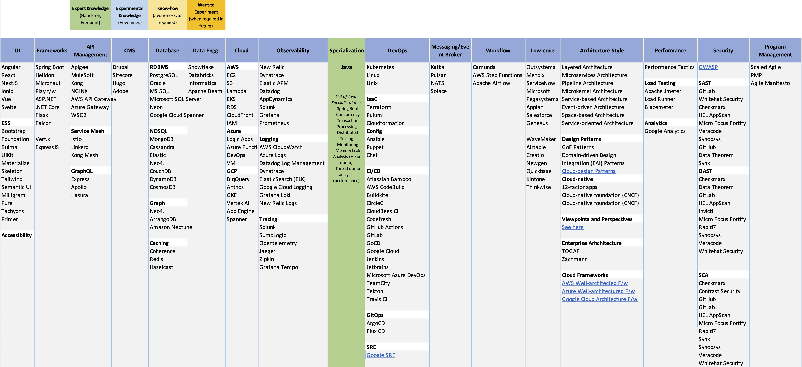
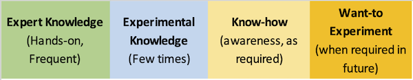
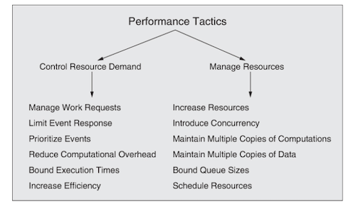
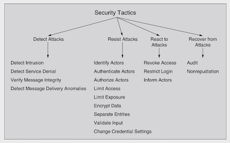

# T-shaped Software Architect
A repository to enlist broader technology knowledge a T-shaped software architect is recommended to aspire for.

## Definition
- A software architect's knowledge base needs to be constantly expanded in the modern environment of rapidly evolving technological dynamics.
> T-shaped skills: The vertical bar on the letter T represents the depth of related skills and expertise in a single field, whereas the horizontal bar is the ability to collaborate across disciplines with experts in other areas and to apply knowledge in areas of expertise other than one's own. [Wikipedia definiton of a T-shaped skills](https://en.wikipedia.org/wiki/T-shaped_skills)
- Applying the above concept of T-shaped skills to a software architect, you can focus on certain areas of technology (such as frontend, backend or full-stack up to certain extent) as a specialist but need to have a broader understanding other technology spectrum.

## Visual Representation

# Specialization Areas (The T-knowledge Vertical Bar)
- Specialization in Java/Python/Golang/JavaScript or any other programming language
- Specialization in web programming, data engineering, machine learning, or other subject areas
- You can choose from the below broader knowledge areas and make one or more as your specialization.

## Knowledge Level
You can broadly classify your knowledge level into 4 different buckets:
- Expert Knowledge: Classify a technology in this area when you are hands-on for more than 3+ years and have in-depth knowledge.
- Experimental Knowledge: Classify a technology in this area when you are hands-on for more than 1+ years and have basic knowledge.
- Know-how: Classify a technology in this area when you are understand the technology and used it on need basis.
- Want-to Experiment: Classify a technology in this area when you want to aspire to learn it in near future.

# Broader Knowledge Areas (The T-knowledge Horizontal Bar)
- The intention is not to enlist every technology and keeping it to 3-7 (currently pupular) in each area.
- Note that this is a community-driven decision and based on observations from the group of people. There is no statistical data available to support this.

## User Experience

### Programming
- Angular
- React
- NextJS
- Ionic
- Vue
- Svelte

### CSS
- Bootstrap
- Foundation
- Bulma
- UIKit
- Materialize
- Skeleton
- Tailwind
- Semantic UI
- Milligram
- Pure
- Tachyons
- Primer

## Microservices/APIs
### Frameworks
- Spring Boot
- Helidon
- Micronaut
- Play f/w
- ASP.NET
- .NET Core
- Flask
- Falcon
- Vert.x
- ExpressJS
- Gokit

## API Management
- Apigee
- MuleSoft
- Kong
- NGINX
- AWS API Gateway
- Azure Gateway
- WSO2

## GraphQL
- Express
- Apollo
- Hasura
## Service Mesh
- Istio
- Linkerd
- Kong Mesh

## Database

### RDBMS
- PostgreSQL
- Oracle
- MS SQL
- Microsoft SQL Server
- Neon
- Google Cloud Spanner
### NOSQL
- MongoDB
- Cassandra
- Elastic
- Neo4J
- CouchDB
- DynamoDB
- CosmosDB
## Graph
- Neo4J
- ArrangoDB
- Amazon Neptune

## Caching
- Redis
- Hazelcast
- Oracle Coherence
- Apache Ignite
- Gigaspaces
- AWS ElasticCache
- Azure Cache
- Google Cloud Memorystore

## Data Warehouse & Datalake

## DWH/Datalake
- Snowflake
- Databricks
- Informatica

## Data Processing & Workflow
- Apache Beam
- Apache Spark
- Apache Airflow

## Messaging/Event-broker
- Kafka
- Pulsar
- RabbitMQ
- NATS
- Solace
## Public Cloud

## Cloud Assessment Migration Frameworks
- [AWS Well-architected Framework](https://aws.amazon.com/architecture/well-architected)
- [Azure Well-architectured Framework](https://learn.microsoft.com/en-us/azure/architecture/framework/)
- [Google Cloud Architecture Framework](https://cloud.google.com/architecture/framework)
### AWS
- EC2
- S3
- Lambda
- EKS
- RDS
- CloudFront
- IAM
### Azure
- Logic Apps
- Azure Function
- DevOps
- VM
### Google Cloud
- BiqQuery
- Anthos
- GKE
- Vertex AI
- App Engine
- Spanner

## Observability

### Monitoring
- New Relic
- Dynatrace
- Elastic APM
- Datadog
- AppDynamics
- Splunk
- Grafana
### Logging
- AWS CloudWatch
- Azure Logs
- Datadog Log Management
- Dynatrace
- ElasticSearch (ELK)
- Google Cloud Logging
- Grafana Loki
- New Relic Logs
### Metrics
- Prometheus
- New Relic
- Dynatrace
- Datadog
- AppDynamics
- Splunk
### Tracing
- Splunk
- SumoLogic
- Opentelemetry
- Jaeger
- Zipkin
- Grafana Tempo

## DevOps

### Kubernetes
- GKE
- EKS
- AKS
- Red Hat OpenShift
### IaaC
- Terraform
- Pulumi
- Cloudformation

### Configuration Management
- Ansible
- Puppet
- Chef

### Continuous Integration/Continuous Deployment
- Atlassian Bamboo
- CircleCI
- CloudBees CI
- Codefresh
- GitHub Actions
- GitLab
- GoCD
- Jenkins
- Jetbrains
- TeamCity
- Tekton
- Travis CI

### GitOps
- ArgoCD
- Flux CD

### SRE
- Google SRE Practices

## Workflow
- Camunda
- AWS Step Functions
- Apache Airflow

## Low-code Platform
- Outsystems
- Mendix
- ServiceNow
- Microsoft
- Pegasystems
- Appian
- Salesforce
- GeneXus
- WaveMaker
- Quickbase

## Performance Engineering

## Performance Tactics

*Reference: [Software Architecture in Practice Book](https://resources.sei.cmu.edu/library/asset-view.cfm?assetid=30264)*
## Load Testing
- Apache Jmeter
- Load Runner
- Blazemeter

## Analytics

### Web Analytics
- Google Analytics
- Google Tag Manager

### Marketing Analytics

## Security

### Security Tactics

*Reference: [Software Architecture in Practice Book](https://resources.sei.cmu.edu/library/asset-view.cfm?assetid=30264)*

### SAST (Static application security testing)
- GitLab
- Whitehat Security
- Checkmarx
- HCL AppScan
- Micro Focus Fortify
- Veracode
- Synopsys
- GitHub
- Data Theorem
- Synk
### DAST (Dynamic application security testing)
- Checkmarx
- Data Theorem
- GitLab
- HCL AppScan
- Invicti
- Micro Focus Fortify
- Rapid7
- Synopsys
- Veracode
- Whitehat Security
### SCA (Software Composition Analysis)
- Checkmarx
- Contrast Security
- GitHub
- GitLab
- HCL AppScan
- Micro Focus Fortify
- Rapid7
- Synk
- Synopsys
- Veracode
- WhiteHat Security

## Software Architecture and Design

### Architectural Styles
- Layered Architecture
- Microservices Architecture
- Pipeline Architecture
- Microkernel Architecture
- Service-based Architecture
- Event-driven Architecture
- Space-based Architecture
- Service-oriented Architecture

### Design Patterns
- GoF Patterns
- Domain-driven Design
- Integration (EAI) Patterns
- [Cloud-design Patterns](https://learn.microsoft.com/en-us/azure/architecture/patterns/)
- Cloud-native
- 12-factor apps
- Cloud-native foundation (CNCF)

### Viewpoints & Perspectives
- [Complete List of Viewpoints & Perspectives](https://www.viewpoints-and-perspectives.info/)

### Enterprise Architecture
- TOGAF
- Zachman
## Program Management
- Scaled Agile
- PMP
- Agile Manifesto

